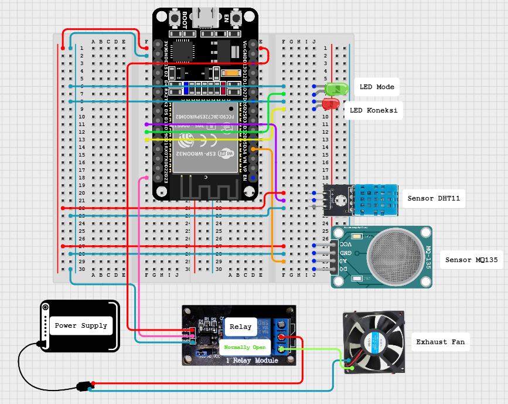
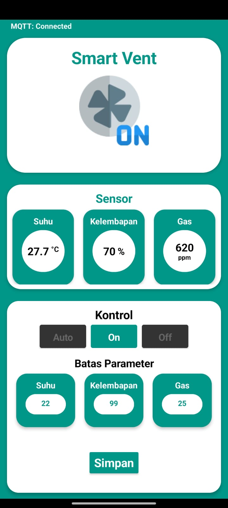

# Smart Vent System 

> Sistem Ventilasi Cerdas Berbasis IoT menggunakan ESP32, Antares MQTT, Kodular, dan Telegram Bot

---

## 📋 Daftar Isi
- [Deskripsi](#-deskripsi)
- [Komponen yang Digunakan](#-komponen-yang-digunakan)
- [Board Schematic](#-board-schematic)
- [Aplikasi Kodular](#-aplikasi-kodular)
- [Telegram Bot](#-telegram-bot)
- [Anggota Kelompok](#-anggota-kelompok)

---

## 📖 Deskripsi

Smart Vent System adalah sistem ventilasi cerdas berbasis Internet of Things (IoT) yang mampu memantau kualitas udara ruangan secara real-time dan mengendalikan kipas ventilasi secara otomatis maupun manual dari jarak jauh. Sistem menggunakan <b>DHT11</b> untuk membaca suhu dan kelembapan udara, serta <b>MQ135</b> untuk mendeteksi konsentrasi gas berbahaya seperti CO₂ dan amoniak. Kipas ventilasi dikendalikan melalui <b>Relay</b> yang diaktifkan oleh mikrokontroler <b>ESP32</b>.

 

Data sensor dikirimkan ke platform cloud <b>Antares</b> menggunakan protokol <b>MQTT</b>, sehingga dapat dipantau secara real-time melalui aplikasi Android yang dibangun dengan <b>Kodular</b>. Pengguna juga dapat mengirimkan perintah kontrol dari aplikasi Kodular yang kemudian disinkronisasikan kembali ke ESP32 melalui mekanisme subscribe MQTT.

 

Selain itu, sistem terintegrasi dengan <b>Telegram Bot</b> yang memungkinkan pengguna memantau status sistem, mengubah mode operasi kipas, menyetel ulang nilai threshold sensor, serta menerima notifikasi peringatan otomatis ketika kondisi lingkungan melampaui batas aman yang ditentukan. Konfigurasi sistem tersimpan secara permanen di memori flash ESP32 menggunakan <b>Preferences (NVS)</b> sehingga pengaturan tidak hilang meskipun perangkat di-restart.

---

## 🔧 Komponen yang Digunakan

| No. | Komponen | Fungsi |
|-----|----------|--------|
| 1 | **ESP32 DevKit V1** | Mikrokontroler utama |
| 2 | **DHT11** | Sensor suhu dan kelembapan |
| 3 | **MQ135** | Sensor kualitas udara / gas |
| 4 | **Relay 5V** | Saklar elektronik untuk exhaust fan |
| 5 | **Exhaust Fan** | Aktuator ventilasi |
| 6 | **LED** (x2) | Indikator koneksi WiFi dan mode Auto |
| 7 | **Breadboard & Kabel Jumper** | Media penghubung komponen |
| 8 | **Antares IoT Platform** | Cloud broker MQTT dan data storage |
| 9 | **Kodular** | Antarmuka monitoring dan kontrol Android |
| 10 | **Telegram Bot** | Kontrol dan notifikasi jarak jauh |

---

## 📐 Board Schematic

### Konfigurasi Pin

| Komponen | Pin Komponen | Koneksi ESP32 |
|----------|-------------|---------------|
| DHT11 | VCC | 3.3V |
| | GND | GND |
| | OUT | GPIO 18 |
| MQ135 | VCC | 3.3V |
| | GND | GND |
| | AOUT | GPIO 34 |
| | DOUT | — |
| Relay | VCC | VIN (5V) |
| | GND | GND |
| | IN | GPIO 23 |
| | COM | + Power Supply |
| | NO | + Exhaust Fan |
| Exhaust Fan | + | NO Relay |
| | - | Ground Power Supply |
| LED Koneksi | Anoda | GPIO 19 via R 220Ω |
| | Katoda | GND |
| LED Mode | Anoda | GPIO 21 via R 220Ω |
| | Katoda | GND |

---

## 📱 Aplikasi Kodular

[📥 Download Smart Vent APK](Smart_Vent.apk)

Aplikasi Android dibangun menggunakan Kodular dan terhubung ke platform Antares via MQTT. Fitur yang tersedia:
- Monitoring data sensor (suhu, kelembapan, gas) secara real-time
- Kontrol mode kipas: Otomatis / Manual ON / Manual OFF
- Pengaturan nilai threshold untuk masing-masing sensor

---

## 🤖 Telegram Bot

Bot dapat diakses dan digunakan langsung melalui Telegram.
[@VentiSmartBot](https://t.me/VentiSmartBot)

### Daftar Command

| Command | Fungsi |
|---------|--------|
| `/start` | Menampilkan panduan lengkap command |
| `/status` | Status real-time sensor, mode kipas, dan subscriber |
| `/fanAuto` | Mengubah ke mode otomatis berbasis threshold |
| `/fanOn` | Kipas menyala terus (Manual ON) |
| `/fanOff` | Kipas mati terus (Manual OFF) |
| `/setBatasSuhu [angka]` | Mengatur threshold suhu (contoh: `/setBatasSuhu 32`) |
| `/setBatasKelembapan [angka]` | Mengatur threshold kelembapan |
| `/setBatasGas [angka]` | Mengatur threshold konsentrasi gas |
| `/seeSubscriber` | Lihat daftar subscriber aktif |
| `/addSubs` | Daftarkan diri sebagai subscriber notifikasi |
| `/deleteSubs` | Hapus diri dari daftar subscriber |

---

## 👥 Anggota Kelompok

| Nama | NIM | Kontribusi |
|------|-----|------------|
| **Injil Karepowan** | 2309106028 | Merancang arsitektur dan logika keseluruhan sistem; merangkai alat; menguji sistem |
| **Muhammad Arya Fayyadh Razan** | 2309106010 | Merancang dan mengimplementasikan setup sistem dan logika Telegram Bot|
| **Ahmad Zuhair Nur Aiman** | 2309106025 | Merancang desain alat; merakit seluruh komponen pada breadboard|
| **Annisa Rosaliyanti** | 23091060127 | Mengkonfigurasi logika integrasi MQTT/Antares; merancang antarmuka Kodular |
